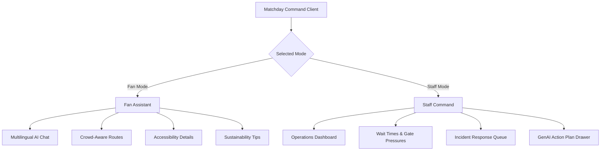

# Product Specification: Matchday Command

**GenAI stadium operations and fan guidance for high-pressure tournament match days.**

Matchday Command addresses the complexity of managing 80,000+ soccer fans during tournament match days. It establishes a coordinated digital environment linking fan guidance with staff operational metrics.

---

## 1. Feature Map & System Architecture

---

## 2. User Flows

### Flow A: Fan Navigation & Assistance
1. **Entrance:** A fan arrives at the stadium and opens the Matchday Command app.
2. **Language Selection:** The fan queries the assistant in their native language (e.g., Spanish: *"¿Dónde está la rampa de acceso para silla de ruedas más cercana?"*).
3. **GenAI Processing:** The server-side Gemini endpoint translates, queries local venue data, and returns a tailored response in Spanish.
4. **Navigation:** The app presents a simulated map routing suggestion avoiding high-density zones (e.g., Gate A bottleneck) and recommending a clear path through Gate B.

### Flow B: Operations Command & Incident Resolution
1. **Alert Trigger:** The central dashboard highlights a high-density alert at the Gate A exit ramp (Gate Pressure: 85%).
2. **Incident Creation:** A new incident ticket (`INC-001`) is generated in the queue.
3. **Action Plan Generation:** Staff clicks "Generate Action Plan". The Gemini API reviews current gate statistics and outputs a tactical response plan (e.g., *"1. Redirect staff to Gate B entrance. 2. Push notification alert to arriving transit riders. 3. Adjust digital signage boards."*).
4. **Volunteer Update:** The system packages the action plan and translates it into instructions for field volunteers.

---

## 3. Simulated Operations Metrics

To ensure a functional mock environment without requiring real integrations, the app leverages simulated operational structures:

| Metric | Type | Simulated Range | Description |
| :--- | :--- | :--- | :--- |
| **Gate Pressure** | Percentage / Status | 0% to 100% (Low / Med / High) | Measures gate throughput density. |
| **Concession wait times** | Duration | 5 min to 45 min | Queue wait estimates at specific venue quadrants. |
| **Active Incidents** | Queue | Active / Closed | Log of safety or crowd flow concerns requiring action plans. |
| **Transit Departures** | Timeline | 0 min to 60 min | Train and bus departures from the stadium transit terminal. |

---

## 4. Evaluator Priority Alignment

- **Problem Alignment (HIGH):** The feature set directly mitigates congestion, coordinates volunteers, and assists disabled attendees.
- **Code Quality (HIGH):** Fully componentized page modularity and robust prop-types.
- **Google Services (VERY HIGH):** Utilizes Firebase Hosting (static asset server), Cloud Run (compute container), and Gemini (Generative models).
- **Security (MEDIUM):** Avoids tracking user locations or storing credentials. Pure client-side UI with backend API key isolation.
