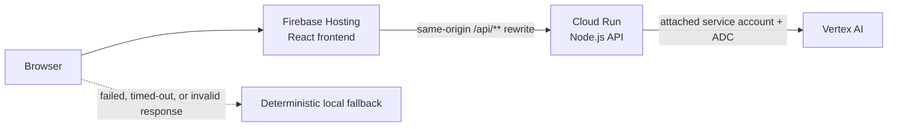

# Matchday Command

**GenAI stadium operations and fan guidance for high-pressure tournament match days.**

[Open the live application](https://matchday-command-2026.web.app) · [View the public repository](https://github.com/aviksh7/matchday-command)

> **Simulated independent prototype.** All venue, gate, crowd, incident, transit, route, and wait-time information is local simulated prototype data. Matchday Command does not connect to official tournament, stadium, ticketing, transit, emergency, or municipal systems and is not affiliated with FIFA or any venue operator. It must not be used for real safety, medical, travel, or operational decisions.

## The problem

Large tournament match days concentrate fan movement, accessibility needs, queues, transit pressure, volunteer coordination, and incident decisions into a short, high-pressure window. Fans need clear guidance while operations teams need a shared view of the same conditions.

## The solution

Matchday Command is a working prototype that presents one **selected simulated venue snapshot** through two perspectives:

- **Fan Mode** offers grounded guidance about lower-pressure gates, lower-wait services, accessibility-ready entrances, simulated transit pressure/status, sustainability tips, and a limited translation demonstration.
- **Operations Mode** presents simulated gate loads, crowd density, service-queue pressure, volunteer coverage, accessibility-request details, incident queues, review-gated decision-support options, and structured response-planning drafts.

The product combines deterministic local logic with two server-side Vertex AI flows. Every generated result identifies whether it came from **Vertex AI via Cloud Run** or the **local deterministic fallback**, and both paths retain simulation and limitation notices.

## Deployed Google Cloud architecture



- **Firebase Hosting** serves the built React frontend and routes same-origin `/api/**` requests to the `matchday-command-api` Cloud Run service.
- **Cloud Run** runs the Node.js API, validates requests and model output, and mediates Vertex AI calls.
- **Vertex AI** is authenticated through the Cloud Run service's attached dedicated service account and Application Default Credentials (ADC). No frontend AI credential and no downloadable runtime service-account key are used.
- `GOOGLE_CLOUD_PROJECT` is supplied explicitly through deployment configuration. ADC supplies authentication credentials; it does not supply that environment setting.
- If a request fails, times out, returns a non-success status, or fails response-schema validation, browser code uses deterministic local logic. The fallback is part of the frontend, not another cloud service.

### Vertex AI's two implemented roles

1. **Fan Assistant structured guidance** — returns a summary, recommended action, simulated data used, and a mandatory limitations note grounded in the selected simulated venue context.
2. **Incident Support structured decision-support drafts** — returns a situation summary, priority, recommended actions, volunteer briefing, announcement draft, accessibility note, crowd/transit note, simulated data used, and limitations.

Incident recommendations, briefings, and announcement text are prototype drafts requiring review by qualified people. They do not dispatch staff, contact emergency services, or publish announcements.

## Challenge-to-feature-to-evidence matrix

| Challenge area | Implemented capability | Current limitation | Implementation or test evidence |
| --- | --- | --- | --- |
| Navigation and fan guidance | Interactive schematic stadium map plus deterministic gate, queue, and movement guidance. Selecting a map incident carries its validated local venue/incident context into Incident Support without an automatic network request. | Not GPS, geographically accurate, or turn-by-turn routing; handoff state is local and ephemeral. | `src/App.tsx`, `src/pages/CrowdMap.tsx`, `src/pages/IncidentSupport.tsx`, `src/components/StadiumMap.tsx`; App, map, and incident UI tests |
| Crowd management | Gate pressure, zone occupancy, volunteer coverage, and priority calculations from local simulated telemetry. | Snapshot data only; no continuously updating sensors or venue feed. | `src/pages/StaffCommand.tsx`, `src/logic/staffCommand.ts`, `src/logic/operations.ts`; staff and operations tests |
| Accessibility | Indicators and schematic routes for every open accessibility-ready gate; Staff request type/status/location/logged-time details; and request-grounded Fan guidance. Compact AI context omits internal request IDs and timestamps. | Not a verified physical venue route or confirmation that assistance was provided, staff were contacted, or dispatch occurred. | `src/components/StadiumMap.tsx`, `src/components/StaffAccessibilityRequests.tsx`, `src/logic/apiClient.ts`, `src/logic/fanAssistant.ts`; API-client, map, fan, and staff tests |
| Transportation | Simulated transit-node pressure/status comparisons and egress cautions. | No timetables, fares, GPS, municipal feeds, or arrival estimates. | `src/data/mockData.ts`, `src/logic/fanAssistant.ts`, `src/logic/crowdMap.ts`; fan and crowd-map tests |
| Sustainability | Simulated refill, waste-sorting, and green-transit indicators with deterministic tips. | Demonstration metrics only; no measured environmental impact or facility feed. | `src/data/mockData.ts`, Fan Assistant and Staff Command; `src/test/fanAssistant.test.ts` |
| Multilingual support | A shared simulated venue announcement drives a limited translation demonstration; the deterministic fallback supplies only a fixed Spanish/French sample. | The UI is English, the fallback cannot translate other text or languages, and language coverage or translation accuracy is not guaranteed. | `src/pages/FanAssistant.tsx`, `src/logic/fanAssistant.ts`; fan assistant and backend prompt tests |
| Operational intelligence | Venue overview, gate loads, dense zones, coverage gaps, accessibility-request records, prioritized items, and locally derived service-queue pressure. Adjacent boundaries require onsite review and state that records do not contact staff or trigger dispatch. | Local snapshot data only; no queue sensors or live service feed, and incident status edits exist only in browser memory. | `src/pages/StaffCommand.tsx`, `src/components/StaffAccessibilityRequests.tsx`, `src/components/StaffServiceQueuePressure.tsx`, `src/logic/staffCommand.ts`; staff command tests |
| Incident response | Existing incident selection, validated map handoff, local scenario creation, local status updates, risk context, and response-planning drafts with visible source and limitations. | No dispatch, persistence, public-address connection, emergency integration, or operational authority. | `src/pages/IncidentSupport.tsx`, `src/components/IncidentDecisionSupportPanel.tsx`, `src/logic/incidentSupport.ts`; App, incident UI, and logic tests |
| Decision support | Structured recommended actions, volunteer briefings, fan-announcement drafts, accessibility notes, and crowd/transit notes with an adjacent qualified-human-review boundary. | Every output is a prototype draft; it neither dispatches staff nor publishes announcements and does not replace trained security, medical, or venue personnel. | Incident schema in `server/app.js`; frontend and backend incident tests |
| GenAI usage | Fan Assistant and Incident Support use Vertex AI through Cloud Run with structured output and visible source labels. | Cloud availability is not guaranteed; failures and invalid output use local deterministic logic. | `src/logic/apiClient.ts`, `server/client.js`, `server/index.js`, `server/app.js`; API client and backend tests |
| Simulated-data honesty | Persistent global notice, page warnings, output limitations, prompt-grounding rules, and source labels. | No official operational information is available anywhere in the prototype. | `src/components/AppShell.tsx`, page notices, server instructions; App, data, fan, incident, and staff tests |

## Security and privacy

- The application has no user authentication or application database.
- It does not intentionally write user queries or generated responses to an application database.
- Queries submitted to cloud AI features are processed by Cloud Run and Vertex AI. Google Cloud services may create operational logs according to the project's service and logging configuration.
- Users must not submit personal, confidential, medical, or emergency information.
- Direct browser CORS accepts fixed local/Hosting origins plus a tightly constrained Firebase preview-origin pattern. The API applies a 10 KB JSON body limit, strict string/object shape and serialized-length validation, nested-context injection inspection, and a basic 30-request/minute per-instance rate limit whose client-key map is capped at 10,000 entries and fails closed at capacity.
- Vertex calls have a 15-second server deadline below the browser's 20-second fallback deadline. Generated output is checked for required nonblank structure on the server and again in the browser; malformed JSON, unsupported API paths, and internal failures receive controlled JSON errors.
- Express disables `X-Powered-By`. API and Hosting responses apply `X-Content-Type-Options`, `Referrer-Policy`, and a restrictive `Permissions-Policy`; hashed assets retain immutable caching while HTML remains non-cached.
- Final root and server full and production-only dependency audits each found **0 vulnerabilities**. Cloud packaging contains exactly **7 runtime files / 120,687 bytes**, excluding dependencies, tests, coverage/config output, and environment files.

These are bounded prototype safeguards, not authentication or a complete distributed abuse-prevention system.

See [SECURITY.md](SECURITY.md) for the focused security model.

## Accessibility

Implemented measures include semantic application landmarks and navigation, visible keyboard focus, a keyboard-operable stadium map (Tab, Enter, Space, and Escape), status announcements for AI loading and map context, native disabled states during requests, reduced-motion support, responsive layouts, and text labels alongside status colors.

The final local browser audit covered all six pages at **320, 390, 768, and 1440 px**. All 24 measurements had no document-level overflow, no visible interactive target below 44 px, a skip link and main landmark, and zero console warnings or errors; mobile-menu focus behavior and map Enter/Space/Escape behavior were also exercised.

These measures do not constitute a formal WCAG certification or guarantee compatibility with every browser and assistive-technology combination. See [ACCESSIBILITY.md](ACCESSIBILITY.md).

## Testing and quality gates

Final local verification under Node 22 produced:

| Evidence | Verified result |
| --- | --- |
| Automated tests | **17 frontend files / 139 tests; 2 backend files / 79 tests; 218 total** |
| Frontend coverage | **92.17% statements / 78.68% branches / 94.07% functions / 94.90% lines** |
| Server coverage | **92.40% statements / 94.92% branches / 96.42% functions / 92.15% lines** |
| Initial eager JS + CSS | **240,433 raw / 72,626 gzip / 62,664 Brotli bytes**; 4,947 gzip bytes below the 77,573-byte ceiling |
| Total emitted JS + CSS | **379,022 raw / 110,142 gzip / 94,933 Brotli bytes** across 9 JS and 7 CSS chunks |

[TESTING.md](TESTING.md) records the historical baseline, final inventory, enforced coverage thresholds, and covered behaviors.

The repository enforces:

- Node.js 22 (`.nvmrc` and package engine declarations)
- strict TypeScript for the frontend and Vite configuration
- Oxlint with warnings denied
- frontend Vitest and React Testing Library tests
- backend Vitest and Supertest tests with the Vertex AI client completely mocked
- enforced frontend and server V8 coverage thresholds
- `npm run check` and `npm run check:coverage` in Firebase Hosting merge and pull-request workflows

Automated tests do not call Firebase Hosting, Cloud Run, Vertex AI, or other external cloud services.

## Local development

### Prerequisites

- Node.js 22.12 or newer (`nvm use` selects the pinned major version)
- npm

### Install and run the frontend

```bash
npm ci
npm --prefix server ci
npm run dev
```

Without a reachable local API, AI requests safely resolve through the deterministic local fallback.

### Optional local Vertex AI path

To exercise the Node.js API locally against Vertex AI, authenticate ADC, copy the documented server environment values into a local uncommitted `.env`, start the server, and point Vite to it with `VITE_API_BASE_URL`:

```bash
gcloud auth application-default login
cp server/.env.example server/.env
npm --prefix server start
```

No Gemini API key or downloaded runtime service-account key is required. Local `.env` files must not be committed.

### Quality commands

```bash
npm run lint
npm run build
npm run test
npm run test:server
npm run test:all
npm run check
npm run check:coverage
```

## Deployment overview

The frontend is built into `dist/` and served by Firebase Hosting. `firebase.json` keeps the `/api/**` Cloud Run rewrite before the single-page-app fallback. The Node.js API is deployed separately to Cloud Run with `GOOGLE_CLOUD_PROJECT` and location supplied by deployment configuration, and it uses its attached runtime identity for Vertex AI access. The Hosting workflows run the full repository quality gate before live or preview deployment.

## Assumptions and limitations

- All capacities, locations, statuses, percentages, incidents, routes, queues, and sustainability values are fictional prototype inputs.
- The selected venue view is a snapshot, not a continuously updating feed.
- The map is schematic and not geographically accurate.
- Transportation content is simulated pressure/status information, not travel planning or departure data.
- Multilingual support is a limited demonstration, not comprehensive localization.
- Operational and announcement outputs are drafts requiring qualified human review; they do not dispatch staff or publish announcements.
- Map handoff only preselects validated, ephemeral local context; it sends no automatic request and performs no operational action.
- Accessibility-request records do not confirm assistance, staff contact, or dispatch.
- There is no user account, database, query history, persistent incident state, notification system, dispatch integration, or external operational connection.
- Matchday Command is an independent prototype and is not affiliated with FIFA, tournament organizers, stadiums, transit agencies, municipalities, or emergency services.
