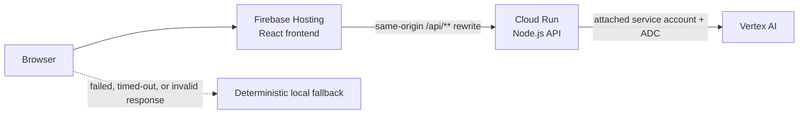

# Matchday Command

**GenAI stadium operations and fan guidance for high-pressure tournament match days.**

[Open the live application](https://matchday-command-2026.web.app) · [View the public repository](https://github.com/aviksh7/matchday-command)

> **Simulated independent prototype.** All venue, gate, crowd, incident, transit, route, and wait-time information is local simulated prototype data. Matchday Command does not connect to official tournament, stadium, ticketing, transit, emergency, or municipal systems and is not affiliated with FIFA or any venue operator. It must not be used for real safety, medical, travel, or operational decisions.

## The problem

Large tournament match days concentrate fan movement, accessibility needs, queues, transit pressure, volunteer coordination, and incident decisions into a short, high-pressure window. Fans need clear guidance while operations teams need a shared view of the same conditions.

## The solution

Matchday Command is a working prototype that presents one **selected simulated venue snapshot** through two perspectives:

- **Fan Mode** offers grounded guidance about lower-pressure gates, lower-wait services, accessibility-ready entrances, simulated transit pressure/status, sustainability tips, and a limited translation demonstration.
- **Operations Mode** presents simulated gate loads, crowd density, volunteer coverage, accessibility requests, incident queues, local recommendations, and structured response-planning drafts.

The product combines deterministic local logic with two server-side Vertex AI flows. Every generated result identifies whether it came from **Vertex AI via Cloud Run** or the **local deterministic fallback**, and both paths retain simulation and limitation notices.

## Deployed Google Cloud architecture



- **Firebase Hosting** serves the built React frontend and routes same-origin `/api/**` requests to the `matchday-command-api` Cloud Run service.
- **Cloud Run** runs the Node.js API, validates requests and model output, and mediates Vertex AI calls.
- **Vertex AI** is authenticated through the Cloud Run service's attached dedicated service account and Application Default Credentials (ADC). No frontend AI credential and no downloadable runtime service-account key are used.
- `GOOGLE_CLOUD_PROJECT` is supplied explicitly through deployment configuration. ADC supplies authentication credentials; it does not supply that environment setting.
- If a request fails, times out, returns a non-success status, or fails response-schema validation, browser code uses deterministic local logic. The fallback is part of the frontend, not another cloud service.

### Vertex AI's two implemented roles

1. **Fan Assistant structured guidance** — returns a summary, recommended action, simulated data used, and a mandatory limitations note grounded in the selected simulated venue context.
2. **Incident Support structured decision-support drafts** — returns a situation summary, priority, recommended actions, volunteer briefing, announcement draft, accessibility note, crowd/transit note, simulated data used, and limitations.

Incident recommendations, briefings, and announcement text are prototype drafts requiring review by qualified people. They do not dispatch staff, contact emergency services, or publish announcements.

## Challenge-to-feature-to-evidence matrix

| Challenge area | Implemented capability | Current limitation | Implementation or test evidence |
| --- | --- | --- | --- |
| Navigation and fan guidance | Interactive schematic stadium map plus deterministic gate, queue, and movement guidance for the selected venue snapshot. | Not GPS, geographically accurate, or turn-by-turn routing. | `src/pages/CrowdMap.tsx`, `src/components/StadiumMap.tsx`, `src/logic/crowdMap.ts`; `src/test/crowdMap*.test.*` |
| Crowd management | Gate pressure, zone occupancy, volunteer coverage, and priority calculations from local simulated telemetry. | Snapshot data only; no continuously updating sensors or venue feed. | `src/pages/StaffCommand.tsx`, `src/logic/staffCommand.ts`, `src/logic/operations.ts`; staff and operations tests |
| Accessibility | Accessibility-ready gate indicators, schematic accessible route, support-request summaries, and accessibility-aware guidance. | Not a verified physical venue route or guarantee of real-world accessibility. | `src/components/StadiumMap.tsx`, `src/logic/fanAssistant.ts`, `src/logic/incidentSupport.ts`; map keyboard and assistant tests |
| Transportation | Simulated transit-node pressure/status comparisons and egress cautions. | No timetables, fares, GPS, municipal feeds, or arrival estimates. | `src/data/mockData.ts`, `src/logic/fanAssistant.ts`, `src/logic/crowdMap.ts`; fan and crowd-map tests |
| Sustainability | Simulated refill, waste-sorting, and green-transit indicators with deterministic tips. | Demonstration metrics only; no measured environmental impact or facility feed. | `src/data/mockData.ts`, Fan Assistant and Staff Command; `src/test/fanAssistant.test.ts` |
| Multilingual support | A limited translation demonstration; the local fallback contains a fixed Spanish/French sample announcement. | The UI is English and language coverage or translation accuracy is not guaranteed. | `src/pages/FanAssistant.tsx`, `src/logic/fanAssistant.ts`; fan assistant tests |
| Operational intelligence | Venue overview, gate loads, dense zones, coverage gaps, accessibility requests, and prioritized operational items. | Local prototype data; incident status edits exist only in browser memory. | `src/pages/StaffCommand.tsx`, `src/logic/staffCommand.ts`; staff command tests |
| Incident response | Existing incident selection, local scenario creation, local status updates, risk context, and response-planning drafts. | No dispatch, persistence, public-address connection, or emergency integration. | `src/pages/IncidentSupport.tsx`, `src/logic/incidentSupport.ts`; incident UI and logic tests |
| Decision support | Structured actions, briefings, announcement drafts, accessibility notes, and crowd/transit notes. | Drafts require human review and do not replace trained security, medical, or venue personnel. | Incident schema in `server/app.js`; frontend and backend incident tests |
| GenAI usage | Fan Assistant and Incident Support use Vertex AI through Cloud Run with structured output and visible source labels. | Cloud availability is not guaranteed; failures and invalid output use local deterministic logic. | `src/logic/apiClient.ts`, `server/client.js`, `server/index.js`, `server/app.js`; API client and backend tests |
| Simulated-data honesty | Persistent global notice, page warnings, output limitations, prompt-grounding rules, and source labels. | No official operational information is available anywhere in the prototype. | `src/components/AppShell.tsx`, page notices, server instructions; App, data, fan, incident, and staff tests |

## Security and privacy

- The application has no user authentication or application database.
- It does not intentionally write user queries or generated responses to an application database.
- Queries submitted to cloud AI features are processed by Cloud Run and Vertex AI. Google Cloud services may create operational logs according to the project's service and logging configuration.
- Users must not submit personal, confidential, medical, or emergency information.
- The API applies an exact CORS allowlist for direct browser origins, a 10 KB JSON body limit, field-length validation, basic prompt-injection rejection, per-instance in-memory rate limiting, response-schema validation, and controlled JSON errors.

See [SECURITY.md](SECURITY.md) for the focused security model.

## Accessibility

Implemented measures include semantic application landmarks and navigation, visible keyboard focus, a keyboard-operable stadium map (Tab, Enter, Space, and Escape), status announcements for AI loading and map context, native disabled states during requests, reduced-motion support, responsive layouts, and text labels alongside status colors.

These measures do not constitute a formal WCAG certification or guarantee compatibility with every browser and assistive-technology combination. See [ACCESSIBILITY.md](ACCESSIBILITY.md).

## Testing and quality gates

Milestone 1B began from a verified checkpoint of **74 frontend tests and 18 backend tests (92 total)**. Project Details coverage is added during this documentation milestone; [TESTING.md](TESTING.md) records the latest verified post-implementation count.

The repository enforces:

- Node.js 22 (`.nvmrc` and package engine declarations)
- strict TypeScript for the frontend and Vite configuration
- Oxlint with warnings denied
- frontend Vitest and React Testing Library tests
- backend Vitest and Supertest tests with the Google AI client completely mocked
- `npm run check` in Firebase Hosting merge and pull-request workflows

Automated tests do not call Firebase Hosting, Cloud Run, Vertex AI, or other external cloud services.

## Local development

### Prerequisites

- Node.js 22.12 or newer (`nvm use` selects the pinned major version)
- npm

### Install and run the frontend

```bash
npm ci
npm --prefix server ci
npm run dev
```

Without a reachable local API, AI requests safely resolve through the deterministic local fallback.

### Optional local Vertex AI path

To exercise the Node.js API locally against Vertex AI, authenticate ADC, copy the documented server environment values into a local uncommitted `.env`, start the server, and point Vite to it with `VITE_API_BASE_URL`:

```bash
gcloud auth application-default login
cp server/.env.example server/.env
npm --prefix server start
```

No Gemini API key or downloaded runtime service-account key is required. Local `.env` files must not be committed.

### Quality commands

```bash
npm run lint
npm run build
npm run test
npm run test:server
npm run test:all
npm run check
```

## Deployment overview

The frontend is built into `dist/` and served by Firebase Hosting. `firebase.json` keeps the `/api/**` Cloud Run rewrite before the single-page-app fallback. The Node.js API is deployed separately to Cloud Run with `GOOGLE_CLOUD_PROJECT` and location supplied by deployment configuration, and it uses its attached runtime identity for Vertex AI access. The Hosting workflows run the full repository quality gate before live or preview deployment.

No deployment is performed as part of Milestone 1B.

## Assumptions and limitations

- All capacities, locations, statuses, percentages, incidents, routes, queues, and sustainability values are fictional prototype inputs.
- The selected venue view is a snapshot, not a continuously updating feed.
- The map is schematic and not geographically accurate.
- Transportation content is simulated pressure/status information, not travel planning or departure data.
- Multilingual support is a limited demonstration, not comprehensive localization.
- Operational and announcement outputs are drafts requiring human review.
- There is no user account, database, query history, persistent incident state, notification system, dispatch integration, or external operational connection.
- Matchday Command is an independent prototype and is not affiliated with FIFA, tournament organizers, stadiums, transit agencies, municipalities, or emergency services.
